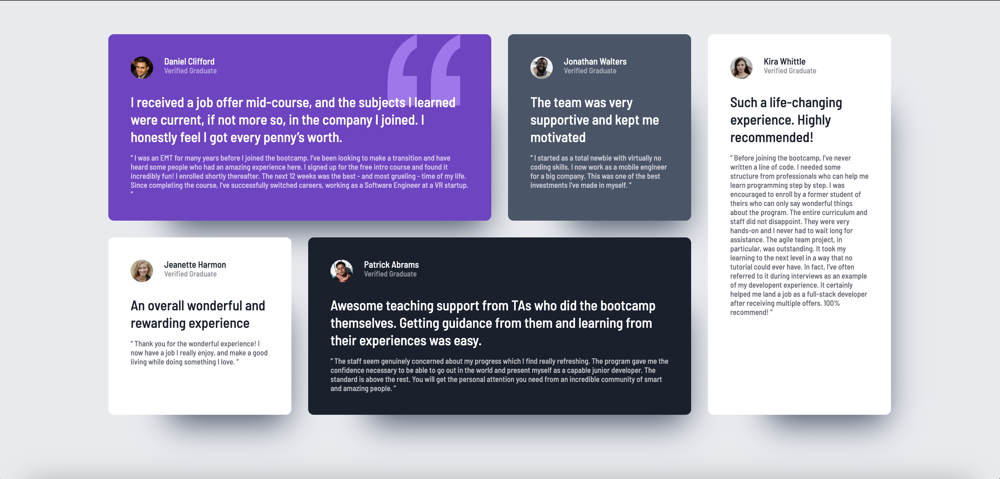

# Frontend Mentor - Testimonials grid section solution

This is a solution to the [Testimonials grid section challenge on Frontend Mentor](https://www.frontendmentor.io/challenges/testimonials-grid-section-Nnw6J7Un7). Frontend Mentor challenges help you improve your coding skills by building realistic projects.

## Table of contents

- [Overview](#overview)
  - [The challenge](#the-challenge)
  - [Screenshot](#screenshot)
  - [Links](#links)
- [My process](#my-process)
  - [Built with](#built-with)
  - [What I learned](#what-i-learned)
  - [Continued development](#continued-development)
  - [Useful resources](#useful-resources)
- [Author](#author)

## Overview

### The challenge

Users should be able to:

- View the optimal layout for the site depending on their device's screen size

### Screenshot



### Links

- Solution URL: [Testimonial Grid Solution](https://github.com/glrodriperez98/testimonials-grid-section)
- Live Site URL: [Testimonial Grid Live](https://glrodriperez98.github.io/testimonials-grid-section/)

## My process

### Built with

- Semantic HTML5
- CSS Grid and Flexbox
- CSS custom properties
- `:nth-child()` selectors for layout control
- Responsive design using media queries
- Mobile-first workflow

### What I learned

One of my biggest takeaways from this project was how powerful and versatile **CSS Grid** can be when building complex layouts. I used `grid-template-areas` and `:nth-child()` selectors together to position each testimonial card exactly where I wanted across various screen sizes.

I also learned how to plan out a **responsive layout** using custom breakpoints to support and convert the pixels to `em`'s for better responsiveness with font-sizing:

- Mobile phones (starting layout)
- Tablets (48em and up)
- Desktops (75em and up)
- Ultra-wide screens (87.5em and up)

Here’s a snippet that helped me control layout using grid and `:nth-child()`:

```
css
.grid {
    display: grid;
    gap: 1.5rem;
    grid-auto-columns: 1fr;
    grid-template: 
        "one"
        "two"
        "three"
        "four"
        "five";

    padding-block: 2rem;
    width: min(95%, 70rem);
    margin-inline: auto;
}
.testimonial:nth-child(1) {
    grid-area: one;
}

.testimonial:nth-child(2) {
    grid-area: two;
}

.testimonial:nth-child(3) {
    grid-area: three;
}

.testimonial:nth-child(4) {
    grid-area: four;
}

.testimonial:nth-child(5) {
    grid-area: five;
}
```
```
@media (min-width: 33em) {
    .grid {
        grid-template-areas:
        "one one"
        "two three"
        "five five"
        "four four";
    }
}
```
### Continued development
I’d like to continue improving at:

Combining CSS Grid with Flexbox for more nuanced layouts

Writing cleaner, scalable media queries

Exploring clamp() and fluid typography for even better responsive text

### Useful resources
CSS Tricks - A Complete Guide to Grid
A great reference for understanding everything CSS Grid can do.

MDN Web Docs - :nth-child()
Helped me fine-tune the layout of each testimonial card.

Kevin Powell - Learn CSS Grid the easy way
An amazing video from our favorite front end friend Kevin Powell. He does this exact challenge so it's hard to force yourself not to copy, but he explains 2 ways to manipulate grid for this challenge and the benefits/limitations of them both.

### Author
Frontend Mentor - [@glrodriperez98](https://www.frontendmentor.io/profile/glrodriperez98)
GitHub - [glrodriperez98](https://github.com/glrodriperez98)